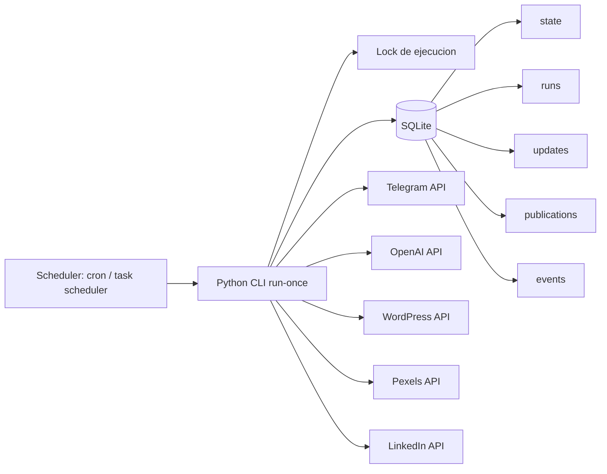
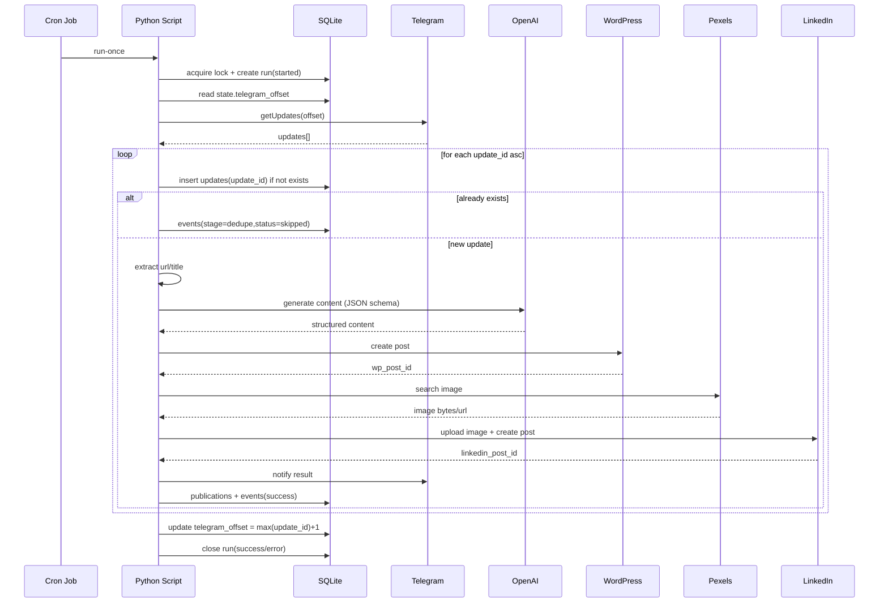

# System Design

## Objetivo

Definir la arquitectura TO-BE del servicio que reemplaza n8n, con foco en estabilidad, idempotencia y trazabilidad por `update_id`.

## Alcance funcional

- Polling de Telegram con `offset` persistente.
- Procesamiento de mensaje por `update_id`.
- Generacion de contenido (OpenAI) y publicacion en WordPress.
- Seleccion/subida de imagen y publicacion en LinkedIn.
- Notificacion a Telegram.
- Auditoria completa en SQLite.

## Diagrama logico

## Componentes

- `app/main.py`: entrypoint CLI, argumentos y lifecycle del proceso.
- `core/pipeline.py`: orquestacion por etapas y reglas de negocio.
- `core/models.py`: contratos tipados de entrada/salida.
- `adapters/*`: clientes de proveedores externos.
- `repositories/*`: acceso a SQLite y transacciones.
- `infra/config.py`: carga y validacion de variables de entorno.
- `infra/logging.py`: logs JSON con `run_id` y `update_id`.
- `infra/retry.py`: politicas de retry/backoff por proveedor.

## Secuencia por update_id

## Reglas de consistencia

- El `offset` solo avanza al final de la corrida y en transaccion.
- `update_id` es clave de idempotencia para evitar duplicados.
- Cada paso escribe `events` para auditoria y reproceso.
- Fallos transitorios: retry con backoff; permanentes: marcar y continuar.

## NFR (Non-Functional Requirements)

- **Reliability**: cero duplicados por `update_id` en destinos finales.
- **Observability**: 100% corridas con `run_id` y eventos de etapa.
- **Security**: secretos por env, sin hardcode en repositorio.
- **Operability**: runbook con troubleshooting y reproceso manual.
- **Maintainability**: coverage de pruebas unitarias e integracion DB.
